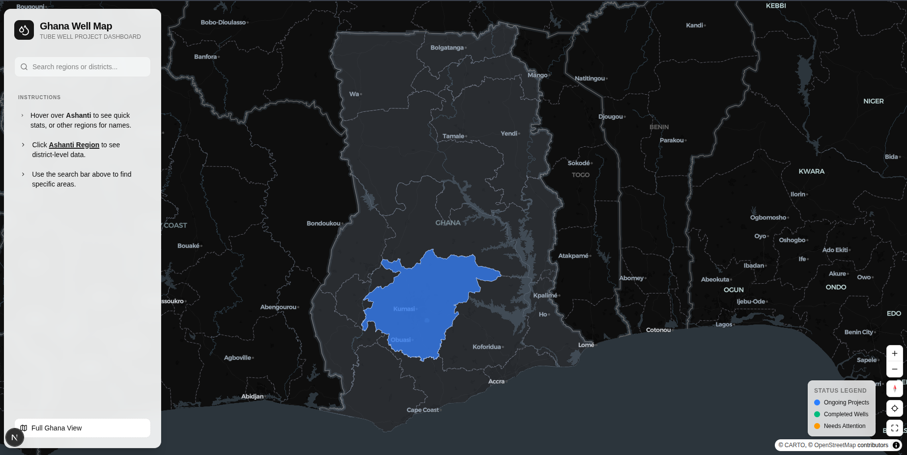

# Ghana Tube Well Map

An interactive, high-performance web dashboard for visualizing tube well statistics across Ghana, with a specialized focus on the Ashanti region. Built with Next.js 16, React 19, and MapLibre GL JS.



## 🚀 Features

- **Interactive National Map**: Explore all 16 regions of Ghana with high-performance GeoJSON rendering.
- **Drill-down to Ashanti**: Smooth transition and zoom into the Ashanti region to view district-level statistics.
- **Real-time Statistics**: Hover over regions or districts to see tube well data:
  - ✅ **Completed**: Number of operational tube wells.
  - ⏳ **Ongoing**: Projects currently in progress.
  - 🔻 **Needed**: Estimated requirement for new wells.
  - 👥 **People in Need**: Estimated population lacking access to clean water.
- **Search & Navigation**: A dedicated sidebar to quickly find and zoom to specific regions or districts.
- **Responsive Design**: Fully responsive layout optimized for both desktop and large-screen displays.
- **Modern UI/UX**: Built with a "premium" aesthetic using Tailwind CSS 4, featuring smooth transitions, glassmorphism effects, and a sleek dark-themed map.

## 🛠️ Tech Stack

- **Framework**: [Next.js 16](https://nextjs.org/) (App Router)
- **Library**: [React 19](https://react.dev/)
- **Mapping**: [MapLibre GL JS](https://maplibre.org/)
- **Styling**: [Tailwind CSS 4](https://tailwindcss.com/)
- **Components**: [Shadcn UI](https://ui.shadcn.com/) & [Radix UI](https://www.radix-ui.com/)
- **Icons**: [Lucide React](https://lucide.dev/)
- **Animations**: [tw-animate-css](https://github.com/nextui-org/tailwind-animations)

## 📁 Project Structure

```text
├── app/                  # Next.js App Router (pages and layouts)
├── components/           # React components
│   ├── ui/               # Reusable UI components (buttons, inputs, etc.)
│   ├── map/              # Custom MapLibre GL JS wrapper components
│   ├── ghana-map.tsx     # Main interactive map logic
│   ├── map-sidebar.tsx   # Search and navigation sidebar
│   └── ...
├── lib/
│   └── data/             # Static statistics (tube-well-stats.json)
├── public/               # Static assets (GeoJSON files, icons)
├── scripts/              # Utility scripts (geodata downloaders)
└── ...
```

## 🚦 Getting Started

### Prerequisites

- Node.js 20+
- pnpm (recommended) or npm/yarn

### Installation

1. Clone the repository:
   ```bash
   git clone https://github.com/morz-mamun/ghana-map.git
   cd ghana-map
   ```

2. Install dependencies:
   ```bash
   pnpm install
   ```

3. Run the development server:
   ```bash
   pnpm run dev
   ```

4. Open [http://localhost:3000](http://localhost:3000) in your browser.

## 📊 Data Sources

- **Geographic Data**: Admin level 1 (Regions) and Admin level 2 (Districts) GeoJSON files sourced via custom scripts.
- **Tube Well Statistics**: Curated data reflecting the current state of water infrastructure development in Ghana.

## 📜 License

This project is licensed under the MIT License - see the [LICENSE](LICENSE) file for details.

---

Built with ❤️ for the community in Ghana.
